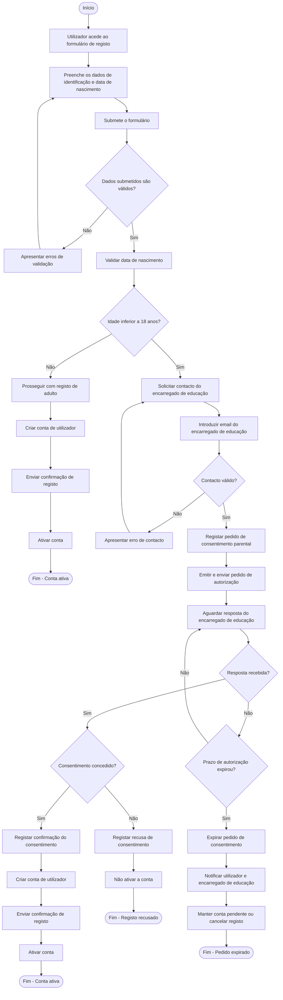

# Fluxograma do processo de registo com consentimento parental

```mermaid
flowchart TD
    A([Início]) --> B[Utilizador acede ao formulário de registo]
    B --> C[Preenche os dados de identificação e data de nascimento]
    C --> D[Submete o formulário]
    D --> E{Dados submetidos são válidos?}

    E -- Não --> F[Apresentar erros de validação]
    F --> C

    E -- Sim --> G[Validar data de nascimento]
    G --> H{Idade inferior a 18 anos?}

    H -- Não --> I[Prosseguir com registo de adulto]
    I --> J[Criar conta de utilizador]
    J --> K[Enviar confirmação de registo]
    K --> L[Ativar conta]
    L --> M([Fim - Conta ativa])

    H -- Sim --> N[Solicitar contacto do encarregado de educação]
    N --> O[Introduzir email do encarregado de educação]
    O --> P{Contacto válido?}

    P -- Não --> Q[Apresentar erro de contacto]
    Q --> N

    P -- Sim --> R[Registar pedido de consentimento parental]
    R --> S[Emitir e enviar pedido de autorização]
    S --> T[Aguardar resposta do encarregado de educação]

    T --> U{Resposta recebida?}

    U -- Sim --> V{Consentimento concedido?}
    V -- Sim --> W[Registar confirmação do consentimento]
    W --> X[Criar conta de utilizador]
    X --> Y[Enviar confirmação de registo]
    Y --> Z[Ativar conta]
    Z --> AA([Fim - Conta ativa])

    V -- Não --> AB[Registar recusa de consentimento]
    AB --> AC[Não ativar a conta]
    AC --> AD([Fim - Registo recusado])

    U -- Não --> AE{Prazo de autorização expirou?}
    AE -- Não --> T
    AE -- Sim --> AF[Expirar pedido de consentimento]
    AF --> AG[Notificar utilizador e encarregado de educação]
    AG --> AH[Manter conta pendente ou cancelar registo]
    AH --> AI([Fim - Pedido expirado])
```