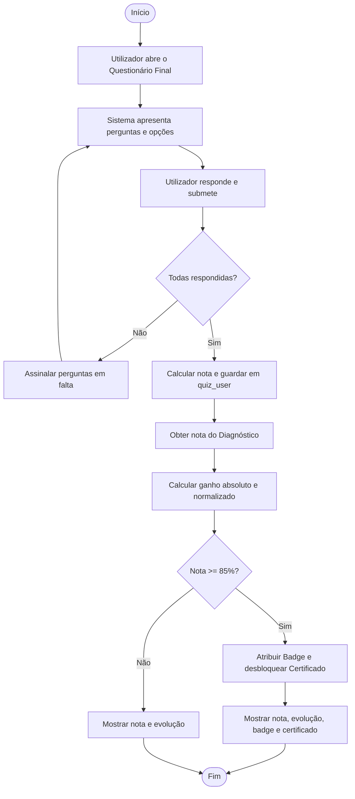

## Fluxograma do Questionário Final

```mermaid
flowchart TD
    A([Início]) --> B[Utilizador abre o Questionário Final]
    B --> C[Sistema apresenta perguntas e opções]
    C --> D[Utilizador responde e submete]
    D --> E{Todas respondidas?}

    E -- Não --> F[Assinalar perguntas em falta]
    F --> C

    E -- Sim --> G[Calcular nota e guardar em quiz_user]
    G --> H[Obter nota do Diagnóstico]
    H --> I[Calcular ganho absoluto e normalizado]
    I --> J{Nota >= 85%?}

    J -- Sim --> K[Atribuir Badge e desbloquear Certificado]
    K --> L[Mostrar nota, evolução, badge e certificado]

    J -- Não --> M[Mostrar nota e evolução]

    L --> N([Fim])
    M --> N
```
